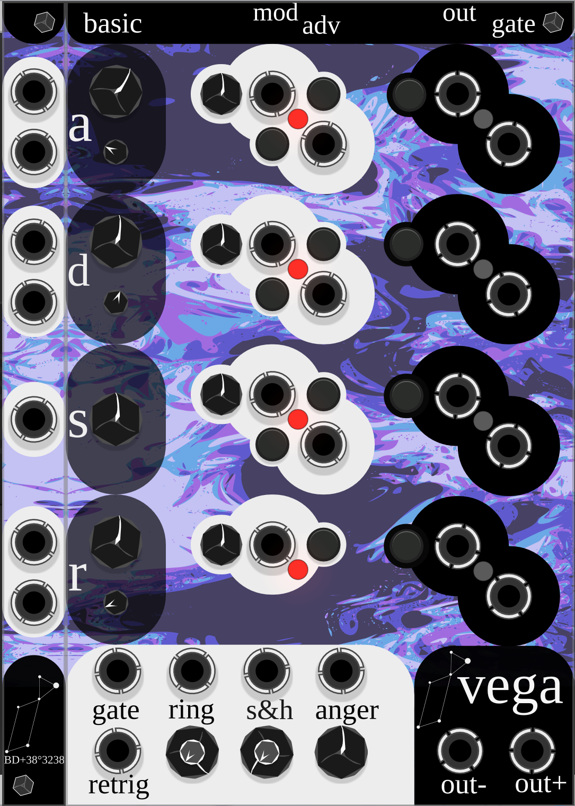
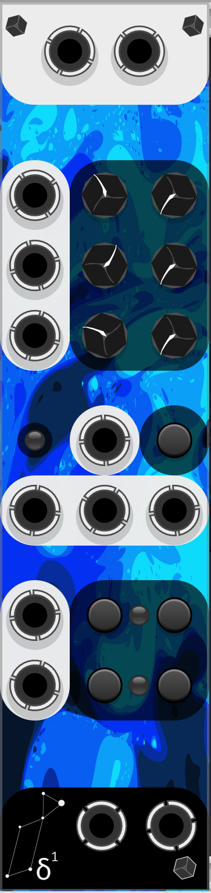

# Lyrae Modules

## Sulafat
> Sulafat has exhausted the supply of hydrogen at its core, and so burns much brighter.
> Sulafat is a wavefolder, and so will make your sound much brighter too!

Sulafat is a multi-mode wavefolder (and a bit more) with some internal modulation that differs between the two channels, with internal normalizing of the left (top) input to the right (bottom) input

0. Bypass
1. Basic Wavefolder
2. 5-level Quantized Wavefolder
3. Tangent + Clamping (sorta still a wavefolder)
4. Split mix of 1 + low-passed 2. Split is inverted on second channel
5. Ring mod - uses internal LFOs if only one input
6. S&H-ish creates some artifacting depending on the input
7. Wavefolding + S&H + LFO mess. This one you just sort of need to hook up to a scope

There's also an easter egg LFO mode, if the top (left) input is left disconnected the two outputs output the internal LFO's.
The left (top) output will be a basic LFO, while the bottom (right) output will be the two LFO's ringmodd'd together.

## γ Lyrae
> It bore the traditional names Sulafat (Sulaphat), from the Arabic السلحفاة al-sulḥafāt "turtle" 
> This module will put a DC offset shell around your signal

Gamma Lyrae is a companion module to Sulafat. With nothing connected, the middle knob will generate two DC voltages, with one being the inverse of the other. The knob can be turned both ways to swap which side is going negative. If a CV input is provided, the knob becomes an attenuverter, but the operation is still effectively the same.

The main inputs (at the bottom) are normalled. These inputs are multiplied (ring modulated) with the center input. This creates two output signals with opposite DC offsets. This will strongly impact the signal fed into the wavofolding modes of Sulafat.

## Vega
> Vega is rotating rapidly with a velocity of 236 km/s at the equator. This causes the equator to bulge outward due to centrifugal effects, and, as a result, there is a variation of temperature across the star's photosphere that reaches a maximum at the poles.
> This module will spin the segments of an envelope generator at high velocities to help you reach new sonic territory

DEMO: https://www.youtube.com/watch?v=aSt3DRtH8tI

Vega is an ADSR with multiple per stage modulation options.

Each stage has a **basic** control section, setting the time (or level, in the case of Sustain) and curve (the smaller knobs), ranging from Logarithmic, to Linear, to Exponential. With only the gate input connected and out+ output connected, Vega behaves as a normal ADSR.

Things are made interesting with the **mod + adv** controls. The controls in order from left to right (or top to bottom, as they're angled) are
* Attenuversion for the modulation input
* The modulation input
* Modulation input mode
* Advance trigger input
* Manual advance trigger

This section offers 4 modes: Ring, Add, Self-Enveloped, and Inverse Ring
* Ring will apply a basic multiplication between the input signal and the respective envelope segment. This has the downside of the 'peak' of the attack causing a very strong modulation, which may transition awkwardly, even with interpolation.
  
  > Note, technically the full math is [(ring_input * attenuverter) * envelope_stage **+ enevelope_stage**] this addition is done so that the ring modulation is still centered around the evelope stage
* Addition will do a basic addition (unity sum) of the input signal and the respective envelope segment. This keeps the level of modulation constant, but may mean that the start of the attack stage and end of the release stage can have gaps or extra bumps.
* Self-Enveloped Addition will cause the input signal to be the same as the ring modulated input for the first 20% of the stage. This gives a gental fade in of the modulation, without making it overtake the signal
* Inverse Ring multiplies the modulation signal with the inverse, offset envelope. This can be used to, for example, make the modulation very strong at the start of the attack stage but 0 at the peak.

There is also a global ring input. This will **only** function in multiplication (basic ring modulation) mode and is done **post** all the other modulation.

The anger knob controls how the modulation inputs are crossfaded between stages, to prevent 'clicks' in the envelope.

Next up, the Advance trigger input and manual trigger button input: Both are to used to force the module to go to the next stage. Note that when going from attack to decay, decay will always start at 10V and that release will start from the level sustain is set to, regardless of if the sustain stage actually happens (if you self patch the sustain gate out to the advance input) 

The module also has per-stage outputs. By default, these will output the current stage's segment **without** modulation. The button will change this though. There's a special mode for the decay stage which outputs the decay stage minus the sustain level, removing the DC offset.
There is also a per-stage gate output, which does what you'd expect.

Because with modulation it is quite easy for the output to get to extreme values, the module hard clips the output to ±12V. If you'd like to avoid some of this clipping, the global ring offset knob (to the left of the anger knob) acts as a global attenuator by default. It is done with the offset knob and not the attenutation knob as this makes sense if you treat the global ring input as just having no signal by default, and a ringmod with DC (offset) acts as a VCA.

For some extra fun, there's a track-and-hold-ish section at the bottom of the module under the anger knob, play with it and see what happens

## Sheliak
> Sheliak is a semidetached binary system made up of a stellar class B6-8 primary star and a secondary that is probably also a B-type star. The fainter, less massive star in the system was once the more massive member of the pair, which caused it to evolve away from the main sequence first and become a giant star. Because the pair are in a close orbit, as this star expanded into a giant it filled its Roche lobe and transferred most of its mass over to its companion.

Sheliak is an analog shift register with some extra tricks. It sholud be fed a x4 (or x8, x12, x16, etc.) clock (and, optionally, reset) and some data, just like any other shift register. The top data input is the main input, the bottom data input will be XOR'd with it so that it can be used for LFSR pseudo-random patterns via self patching. The left 8 outputs are the main outputs and will be shifted every 4th clock pulse. 

The Three outputs going up the left side from the bottom are triplet outputs, reflecting the XOR'd clocke'd in data (just like the main shift register) but this will update every 3rd clock pulse.

### β Lyrae

Beta Lyrae is the same star as Sheliak, just a different name.

This module is an expander. It provides 8 outputs which are derived from the gates produced by Sheliak and the attenuators it provides.

Output operations, from top to bottom:

1. Σ1-8
2. Σ1-4
3. Σ5-8 + perfect fifth (7/12 volt)
4. Σ3-6 + 2 octaves (2 volts)
5. (Σ1-4 % 1V) - 1V (Contrained to the same octave then down 1 octave)
6. Σ1-8 PLUS 1 octave per triplet output that is high MINUS 2 octaves
7. IF the first gate output AND the first triplet gate output are high, update to be the Σ1-4 + Σ1t-3t
8. Σ1t-3t

## ζ Lyrae - TODO
> Zeta Lyrae is a binary star in the northern constellation of Lyra.

It's a blank, but it has 'flip' option in the right click menu. Entire panel renders as a light.

## δ1 Lyra

> The star is radiating about 3,620 times the Sun's luminosity from its photosphere at an effective temperature of 20,350 K

DEMO: https://www.youtube.com/watch?v=FvsLZEobSp0

This module, frankly, is pretty useless. The top section is 3 cascaded ring-mod's, that is if you label them from top to bottom as A, B, C the operation is Left = Left * -(A * (B * C)) Right = Right * (A * (B * C)) Each stage, A, B, C has it's own attenuator (left) and offset (right). If you would like to bypass this stage (other than inverting the left signal), just set all the offset knobs to their max value. if you do not set the offset high or provide input for each of the 3 stages you will not get any output!

Next, is the clock-selected ring mod section. The upper, middle input is the clock input. The LED on the upper left will show what output is being used- RED for the left input, GREEN for the middle input, and BLUE for the right input.

Finally, in the last section, the two inputs are actually gate inputs and toggle channel cross-ring-mod. That is, if the top input of the bottom section is brought high, the right channel will be multiplied with the left, and if the bottom input is brought high, the left channel multiplied with the right.

It's pretty easy to get a really high output from this module, or to just get awful sounds. So, watch your levels and probably use a clipping VCA like ZZC's used here, and try to keep input content harmonically related. Octaves tend to work well.
