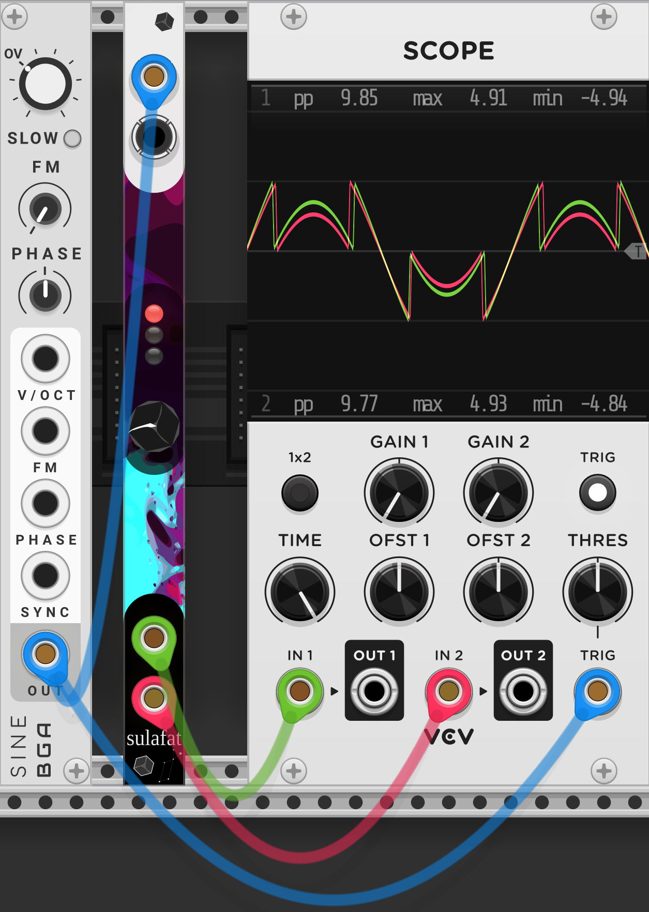
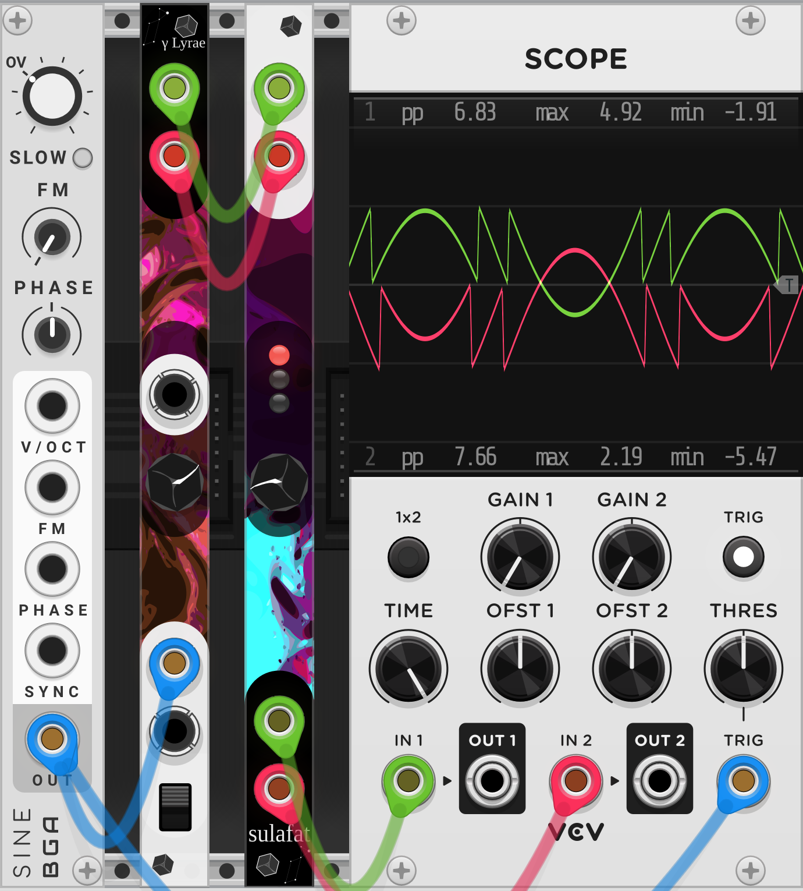

# Lyrae Modules

## Sulafat
> Sulafat has exhausted the supply of hydrogen at its core, and so burns much brighter.
> Sulafat is a wavefolder, and so will make your sound much brighter too!

Sulafat is a multi-mode wavefolder (and a bit more) with some internal modulation that diffeers between the two channels, with internal normalling of the left (top) input to the right (bottom) input

0. Bypass
1. Basic Wavefolder
2. 5-level Quantized Wavefolder
3. Tangent + Clamping (sorta still a wavefolder)
4. Split mix of 1 + low-passed 2. Split is inverted on second channel
5. Ring mod - uses internal LFOs if only one input
6. S&H-ish creates some artifacting depending on the input
7. Wavefolding + S&H + LFO mess. This one you just sort of need to hook up to a scope

There's also an easter egg LFO mode, if the top (left) input is left disconected the two outputs output the internal LFO's.
The left (top) output will be a basic LFO, while the bottow (right) output will be the two LFO's ringmodd'd together.

## γ Lyrae
> It bore the traditional names Sulafat (Sulaphat), from the Arabic السلحفاة al-sulḥafāt "turtle" 
> This module will put a DC offset shell around your signal

Gamma Lyrae is a companion module to Sulafat. With nothing connected, the middle knob will generate two DC voltage, with one being the inverse of the other. The knob can be turned both ways to swap which side is going negative. If a CV input is provided, the knob becomes an attenuverter, but the operation is still effectively the same.

The main inputs (at the bottom) are normalled. These inputs are multiplied (ring modulated) with the center input. This creates two output signals with opposite DC offsets. This will strongly impact the signal fed into the wavofolding modes of Sulafat.

## Vega
> Vega is rotating rapidly with a velocity of 236 km/s at the equator. This causes the equator to bulge outward due to centrifugal effects, and, as a result, there is a variation of temperature across the star's photosphere that reaches a maximum at the poles.
> This module will spin the segments of an envelope generator at high velocities to help you reach new sonic territory

Vega is an ADSR with multiple per stage modulation options.

Each stage has a **basic** control section, setting the time (or level, in the case of Sustain) and curve, ranging from Logorithmic, to Linear, to Exponential. With only the gate input connected and out+ output connected, this behaves as a normal ADSR.

This is followed by the **ring + adv** stage. The controls in order from left to right (or top to bottom, as they're angled) are
* Attenutation for the ring input
* The ring input
* Ring input mode
* Advance trigger input
* Manual advance trigger

This section offers 4 modes: Ring, Add, Attack-Enveloped addition, and Decay-Enveloped addition.
* Ring will apply a basic multiplition between the input signal and the respective envelope segment. This has the downside of the 'peak' of the attack causing a very strong modulation, which may transition awkwardly, even with interpolation.
* Addition will do a basic addition of the input signal and the respective envelope segment. This keeps the level of modulation constant, but may mean that the start of the attack stage and end of the release stage can have gaps or extra bumps.
* Attack-Enveloped Addition will cause the input signal to be the same as the ring modulated input, until the stage's signal goes over 1V. This gives a gental fade in of the modulation, without making it overtake the signal - **only avalibale on the attack stage**
* Decay-Enveloped Addition will cause the signal to be the simple sum of the two signals until the stage is only 1V above the next stage's level (sustain level or 0v on release) where instead the signal will be the ring-modulated signal, allowing for a cleaner fade to the next stage - **only avaliable in the decay and release stages**
  * if there is no ring input on the sustain stage, the decacy stage will fade to being multiplied by 0 instead of fading to being multiplied by the sustain level. This is provide a smooth transition if the sustain stage has no modulation

There is also a global ring input. This will **only** function in multiplication (basic ring modulation) mode and is done **post** all the other modulation.

Finally, the anger knob: This knob controls how quickly the module will become angry with you and move to other modes of smooth transitions between stages. This is needede because the module has multiple ways of seeking a clean transition between stages. The module first tries check if both signals (the end of the current stage + modulation and the start of the next stage + modulation) are approximately equal. if they are, a transition (with linear interpolation) is done immeditately. If they are *not* the anger knob will set how long it should wait for them to be, and if they do not align for a smooth transition after that amount of time, the module, becoming angry, will forcibly transition the two signals. While interpoltion is still used for this transition, it may create audible clicks.

This brings up the use of the Adavce trigger input as well as the manual trigger button input. Both are to used to force the module to be angry, forcing a move onto the next stage. This can be particularly interesting if the current stage has not yet actually completed, as whatever the current value is will be interpolated to the next value right away. This may create sharp, audible clicks though.

The module also has per-stage outputs. These will output the current stage's segment **without** modulation. The button will invert the direction of the slope. For example, with a decay stage going from 10V to 5V in 1 second, inverted, you would get an output with a positive slope going from 5V to 10V in 1 second. This can be useful for sending out envelopes to whatever will end up driving the ring input of the stage.
There is also a per-stage gate output, which will be high so long as that stage is active. Note, the gate will stay high until the next stage has started, but the next stage will go high as soon as it's trying to start. This means, when being held waiting for a transition it is possible for two stages to have high gate outputs simultaniously. You may want to use boolen logic modules on these outputs accordingly.

Idea: What if I just X-Fade the modulation inputs on transition instead of interpolating? This seem like it would work a lot better, and potentially be computationally cheaper... plus I don't have to try implimenting either a cubic spline or anything fancy, and could just use math::crossfade ¯\\_(ツ)_/¯

## Sheliak
> Sheliak is a semidetached binary system made up of a stellar class B6-8 primary star and a secondary that is probably also a B-type star. The fainter, less massive star in the system was once the more massive member of the pair, which caused it to evolve away from the main sequence first and become a giant star. Because the pair are in a close orbit, as this star expanded into a giant it filled its Roche lobe and transferred most of its mass over to its companion.

Idea: 8 bit A→D→A, but the most significant bit has a different input signal
## ζ Lyrae
> Zeta Lyrae is a binary star in the northern constellation of Lyra.

Idea: Sustain from that MIT licenced repo
## δ1 Lyra
> The star is radiating about 3,620 times the Sun's luminosity from its photosphere at an effective temperature of 20,350 K
## ε Lyrae
> Epsilon Lyrae (ε Lyr, ε Lyrae), also known as the Double Double, is a multiple star system of at least five stars

Idea: Disaster Trasport Sr clone. It definitely needs filtering, shorter delay can be brighter. Stereo, slightly different delay times

Using https://www.1001freefonts.com/tinos.font